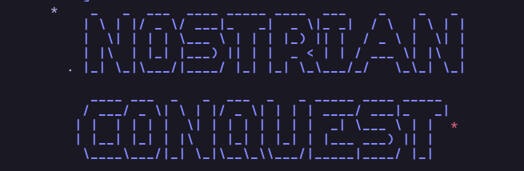

# Nostrian Conquest

_Nostrian Conquest is a from-scratch Rust recreation of the 1990's BBS door game Esterian Conquest. It uses Nostr for decentralized hosted play. All code is original. It is not affiliated with any historical release._

**Status:** `v1.0.0-beta.2`  
Active beta. The Rust player and sysop stack is playable now. The main work is live playtesting, bug fixing, and tightening the rough edges.



[View screenshots](https://nostrian-conquest.com/screenshots.html)

## What It Is

Beyond the old Nostrian frontier lies an abandoned galaxy. The old stations are silent.
The borders are open. You start with four fleets, an isolated homeworld, and enough industry
to kickstart an empire.

NC preserves the yearly-turn campaign rhythm, the reports, the maps, and the
old-school pressure of the original game. The engine is modern Rust. Hosted
campaigns run from SQLite. Classic EC compatibility stays at the oracle and
import/export boundary.

If you want the recovery background, see
[How the Game Was Recovered](docs/dev/approach.md#how-the-game-was-recovered).

## Current Public Roles

Keep the binaries straight:

- `nc-connect`: packaged player client for the normal hosted Nostr flow
- `nc-game`: direct local or SSH session client
- `nc-door`: BBS door entrypoint
- `nc-sysop`: sysop and host administration tool
- `nc-cli`: internal developer, oracle, and compatibility tool

Hosted Rust games are DB-only. A normal hosted game directory contains
`ncgame.db` and nothing else.

## Play

NC is built for native Windows, Linux, and macOS clients. No web app. No BBS
middleware required (but supported) for the modern hosted path.

If you want a live game, start at
[nostrian-conquest.com](https://nostrian-conquest.com). That page points to the
current public meeting places for announcements, player recruitment, and the
Discord invite:
[discord.gg/FMr8sfBa](https://discord.gg/FMr8sfBa).

### Player Flow

1. Get an invite code from the sysop.
2. Install the public `nc-connect` package from GitHub Releases.
3. Open `nc-connect`.
4. Press `N`.
5. Paste the invite code.

`nc-connect` creates and protects the local keychain, joins the hosted game, and
opens the SSH-backed `nc-game` session for you.

IMPORTANT: one keychain identity can claim only one seat in a given hosted game.
If you already joined that game, reconnect with the same identity instead of
redeeming another invite from it.

NOTE: the packaged `nc-connect` GUI does not use command-line arguments. Open
it and press `N`. The Cargo/source companion tool is `nc-connect-cli`.

### Public Beta Downloads

During the current beta, public GitHub Releases publish:

- `nc-connect` player archives for Windows x64, Linux x64, and macOS Apple Silicon
- `nc-sysop` archives for Windows x64, Windows x86 (32-bit), Windows 7+ x86 (32-bit), and Linux x64

The public player archive is the normal handoff for hosted play. The public
sysop archive is the normal BBS/sysop package. Localhost play and VPS hosting
still use source builds. See [Release Policy](docs/release-policy.md).

## Learn The Game

Start with the current Rust manuals:

- **[NC Player Manual (PDF)](docs/manuals/nc_player_manual.pdf)**
- **[NC Sysop Manual (PDF)](docs/manuals/nc_sysop_manual.pdf)**

Historical `.DOC` files remain preserved in [original/v1.5](original/v1.5).

## Quick Start

### 1. Run One Local Or Trusted SSH Game

Create one hosted game:

```bash
cd rust
cargo run -q -p nc-sysop -- new-game /srv/nc/games/friday-night --name "Friday Night NC" --players 4
```

That game directory contains one runtime file:

```text
/srv/nc/games/friday-night/
  ncgame.db
```

Open the player client directly:

```bash
cd rust
cargo run -q -p nc-game --bin nc-game -- --dir /srv/nc/games/friday-night --player 1
```

Run maintenance when needed:

```bash
cd rust
cargo run -q -p nc-sysop -- maint /srv/nc/games/friday-night 1
```

IMPORTANT: use `--bin nc-game` in source builds. The `nc-game` package also
ships `nc-door`, so plain `cargo run -p nc-game` is ambiguous.

### 2. Host Many Games On One VPS

1. Build `nc-game` and `nc-sysop` from source.
2. Run the installer.
3. Create one or more games.
4. Register those games with the gate config.

Bootstrap the standard VPS layout:

```bash
sudo ./scripts/install_vps.sh --relay wss://relay.example.com --ssh-host play.example.com
```

The installer stages:

```text
/usr/local/bin/nc-game
/usr/local/bin/nc-sysop
/usr/local/bin/nc-gate-keys
/etc/nc-gate/config.kdl
/etc/nc-gate/identity.kdl
/var/lib/nc-gate/keys/
/srv/nc/games/<slug>/ncgame.db
```

Create and register a hosted game:

```bash
sudo -u ncgame /usr/local/bin/nc-sysop new-game /srv/nc/games/friday-night --name "Friday Night NC" --players 4
sudo /usr/local/bin/nc-sysop host games add --config /etc/nc-gate/config.kdl --dir /srv/nc/games/friday-night
sudo systemctl restart nc-nostr.service
```

The installer already creates the host identity, writes the gate config, and
enables `nc-nostr.service` plus `nc-maint-all.timer` unless you tell it not to.

Inspect the registered host state:

```bash
sudo /usr/local/bin/nc-sysop host status --config /etc/nc-gate/config.kdl
sudo -u ncgame /usr/local/bin/nc-sysop nostr seats --dir /srv/nc/games/friday-night
```

If a hosted invite drifts or a player cannot find a pending invite, compare the
local game state to relay metadata and republish if needed:

```bash
sudo /usr/local/bin/nc-sysop nostr verify --dir /srv/nc/games/friday-night
sudo /usr/local/bin/nc-sysop nostr publish --dir /srv/nc/games/friday-night
```

To hand an already-joined hosted empire to a new NC identity, rotate that
seat's invite and have the replacement player redeem the new code:

```bash
sudo -u ncgame /usr/local/bin/nc-sysop nostr reissue --dir /srv/nc/games/friday-night --player 3
```

To fully rewind one hosted seat back to a true pre-join state during year 3000
before the first maintenance turn, use the destructive reset path instead:

```bash
sudo -u ncgame /usr/local/bin/nc-sysop nostr reissue --dir /srv/nc/games/friday-night --player 3 --nuke-seat
```

### 3. Run `nc-door` As A BBS Door

For BBS campaigns, write a minimal per-game `config.kdl` first. For example:

```kdl
players 4
reservations {
  seat player=1 alias="SYSOP"
}
```

Then initialize the campaign in BBS mode:

```bash
cd rust
cargo run -q -p nc-sysop -- new-game --bbs /srv/nc/games/night-shift
```

BBS campaigns keep that `config.kdl` beside `ncgame.db`.

Stage `nc-door` as the live BBS binary. For working host setups, see:

- [Mystic BBS Setup](docs/sysop/bbs/mystic-bbs-setup.md)
- [Synchronet BBS Setup](docs/sysop/bbs/synchronet-bbs-setup.md)
- [ENiGMA½ BBS Setup](docs/sysop/bbs/enigma-bbs-setup.md)
- [WWIV BBS Setup](docs/sysop/bbs/wwiv-bbs-setup.md)

## Operator Docs

- [NC Sysop Manual (PDF)](docs/manuals/nc_sysop_manual.pdf)
- [Sysop Documentation Index](docs/sysop/README.md)
- [NC Player Manual (PDF)](docs/manuals/nc_player_manual.pdf)
- [nc-connect Notes](docs/nostr/ec-connect.md)

## Developer Commands

Inspect a game directory:

```bash
cd rust
cargo run -q -p nc-cli -- core-report /tmp/nc-game
```

Inspect player mail:

```bash
cd rust
cargo run -q -p nc-cli -- inspect-messages /tmp/nc-game
```

Seed one `nc-dash` stress lab with all four map-size tiers:

```bash
cd rust
cargo run -q -p nc-cli -- harness seed-nc-dash-lab --root /tmp/nc-dash-lab
```

Or use the repo wrapper from the root:

```bash
python3 scripts/setup_nc_dash_lab.py --root /tmp/nc-dash-lab --force
```

Submit a turn file without opening the TUI:

```bash
cd rust
cargo run -q -p nc-game --bin nc-game -- submit-turn --check --dir /tmp/nc-game --player 1 --file /tmp/turn.kdl
```

`nc-cli` remains the internal developer, oracle, and compatibility surface.
Normal player and sysop workflows should prefer `nc-game`, `nc-door`, and
`nc-sysop`.

## Local Dependencies

- Rust toolchain
- Python 3
- `sccache` (recommended)

For DOSBox-X, Ghidra, and other compatibility tooling, see the contributor
docs under `docs/dev/`.

## For Contributors

Read these first:

- [docs/dev/next-session.md](docs/dev/next-session.md)
- [docs/dev/approach.md](docs/dev/approach.md)
- [docs/dev/rust-architecture.md](docs/dev/rust-architecture.md)

## Repository Layout

- `original/`: preserved original binaries and manuals
- `docs/`: manuals, sysop docs, and engineering notes
- `rust/`: engine, clients, sysop tools, and support crates
- `tools/`: oracle runners and analysis scripts
- `scripts/`: install, packaging, and release helpers

## License

Source code and tooling are licensed under the **O'Saasy License Agreement**.
See [LICENSE](LICENSE).

The repository also preserves original `Esterian Conquest` materials for
research and compatibility work, but Nostrian package archives do not include
them.
