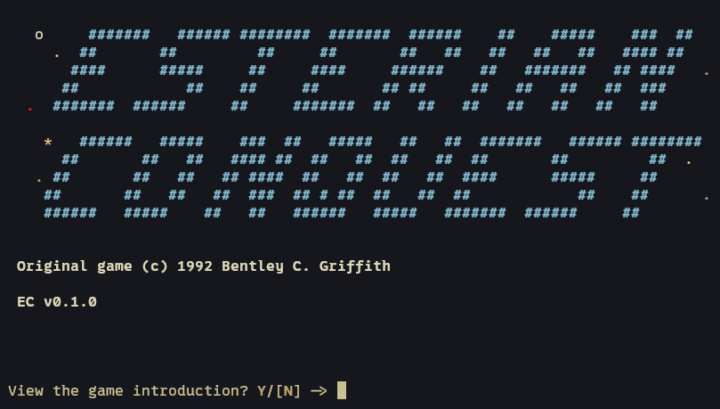
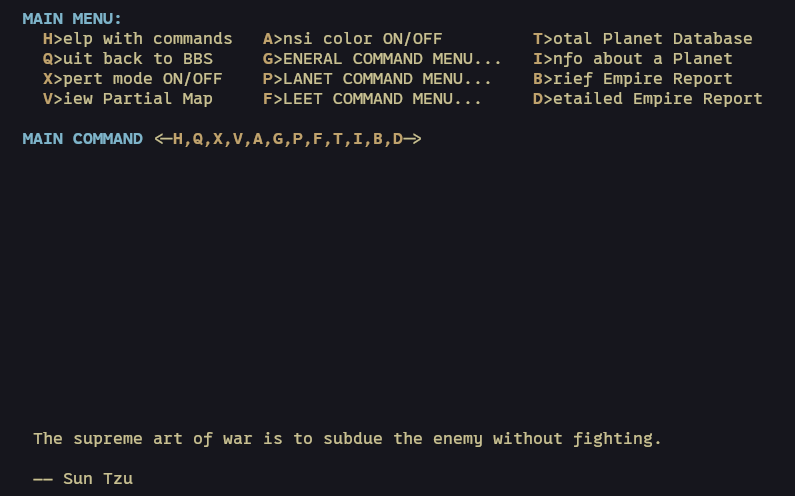
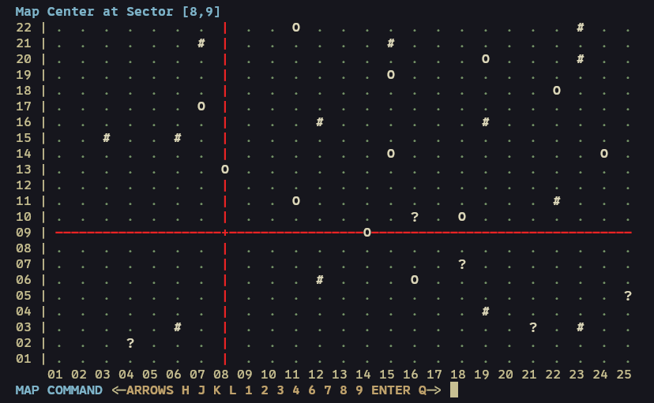
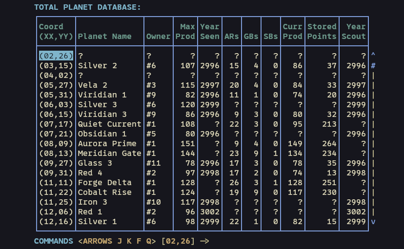

# esterian_conquest


_Esterian Conquest (c) 1992 Bentley C. Griffith. A fan-built resurrection._

**Status:** v1.0.0-beta.1 — Playable beta. Seeking playtesters and sysops.

## Premise

Beyond the mapped frontiers of the old Esterian dominion lies a galaxy of contested solar systems. The old masters are gone. Their stations are silent. You are left with a fleet, a factory, and the knowledge to build an empire.

EC is a faithful reconstruction. We kept the campaign feel, the menus, the reports, and the old-school tension — now running on a modern Rust engine.

## Screenshots

  
  
  


## Play

Esterian Conquest is best played today over **Nostr**.

Nostr is the protocol that powers multiplayer in EC. It delivers a clean, secure, and decentralized experience — no traditional BBS middleware, no manual Unix accounts, and far less middleman friction than the old days.

Joining is straightforward:

- A sysop gives you an invite code. You join the campaign with a single command.
- The `ec-connect` tool creates and manages your encrypted Nostr identity, then opens a secure SSH-backed session.
- On Windows, the public archive now ships both `ec-connect.exe` for the normal GUI-first player flow and `ec-connect-cli.exe` for direct terminal workflows.
- On your first connection, the client automatically downloads the campaign starmap and CSV sheets to your local machine. From then on, your assets stay on your own system.

This keeps the classic EC rhythm — connect, read reports, issue orders, log out — while cutting away most of the old friction. Just you, your empire, and the stars.

### Local and Hotseat
Play entirely in your terminal. Launch `ec-game` against a local campaign directory to learn the interface, test scenarios, or run a private campaign on one machine.

### BBS Hosting
We still support legacy BBS doors. The Rust client works natively with `DOOR32.SYS`, `DOOR.SYS`, and `CHAIN.TXT`. It is the perfect drop-in replacement for sysops running classic environments on modern hardware.

## Learn How To Play

The manuals cover everything from quick-start basics to deep strategy:

- **[EC Player Manual (PDF)](docs/manuals/ec_player_manual.pdf)**
- **[EC Sysop Manual (PDF)](docs/manuals/ec_sysop_manual.pdf)**

Historical `.DOC` files are preserved in [original/v1.5](original/v1.5).

## Beta Release Policy

Public Rust downloads are intentionally limited during beta. The current
policy is:

| Audience | Current Path |
|---|---|
| Normal player | Download the public `ec-connect` archive and use the bundled player manual PDF |
| Rust self-host sysop | Build from tagged source with Cargo |
| Rust VPS sysop | Build from tagged source with Cargo and use `scripts/install_vps.sh` |
| BBS sysop | Build from source, or use a direct/private beta build |

Public GitHub Releases currently keep the DOS compatibility bundles plus the
player-facing `ec-connect` archives. The public `ec-connect` downloads include
a signed `SHA256SUMS.txt` manifest for verification.
See [Release Policy](docs/release-policy.md).

## Background

Esterian Conquest was a 1992 BBS door game with yearly turns and printed starmaps. This project is a full reimplementation in Rust — not a wrapper, but a ground-up reconstruction of the original rules and feel.

If you want to know how the recovery work was done, see [How EC was recovered](docs/dev/approach.md#how-ec-was-recovered).

The engine is explicit. Seeded RNG ensures reproducible results, and the logs explain exactly why a combat resolved the way it did.

**[Read the Grand Vision: From BBS to the Decentralized Web](docs/grand-vision.md)**

## Quick Start

### 1. Self-Host One Game
```bash
cd rust
cargo run -q -p ec-sysop -- new-game /srv/ec/games/friday-night --name "Friday Night EC" --players 4
```

Each hosted game directory contains one runtime file:

```text
/srv/ec/games/friday-night/
  ecgame.db
```

Run the client directly for local play or trusted SSH use:
```bash
cd rust
cargo run -q -p ec-game -- --dir /srv/ec/games/friday-night --player 1
```

Advance the game when needed:
```bash
cd rust
cargo run -q -p ec-sysop -- maint /srv/ec/games/friday-night 1
```

### 2. Host Many Games On One VPS
Bootstrap the standard host layout:
```bash
sudo ./scripts/install_vps.sh \
  --relay wss://relay.example.com \
  --ssh-host play.example.com
```

That installs:

```text
/usr/local/bin/ec-game
/usr/local/bin/ec-sysop
/usr/local/bin/ec-gate-keys
/etc/ec-gate/config.kdl
/etc/ec-gate/identity.kdl
/var/lib/ec-gate/keys/
/srv/ec/games/<slug>/ecgame.db
```

The host relay and game-server address live in `/etc/ec-gate/config.kdl`.
`install_vps.sh` writes them from `--relay`, `--ssh-host`, and `--ssh-port`.
If you change them later, edit that file and restart `ec-nostr.service`.
If you self-host the relay on the same VPS, the relay host also needs a
public HTTPS websocket front end. A common setup is `nostr-rs-relay` bound
to `127.0.0.1:8080` with Caddy or another reverse proxy serving
`relay.example.com` on `443`.

Create and register games:
```bash
cargo run -q -p ec-sysop -- new-game /srv/ec/games/friday-night --name "Friday Night EC" --players 4
sudo /usr/local/bin/ec-sysop host games add --config /etc/ec-gate/config.kdl --dir /srv/ec/games/friday-night
sudo systemctl restart ec-nostr.service
```

Run the daemon:
```bash
cd rust
cargo run -q -p ec-sysop -- nostr init
cargo run -q -p ec-sysop -- nostr serve
```

Schedule the fleet-wide sweep with `systemd` or `cron`:
```bash
cargo run -q -p ec-sysop -- maint-all --config /etc/ec-gate/config.kdl
```

Players join with `ec-connect`:
```bash
ec-connect --join amber-river@relay.example.com
```

### 3. Run `ec-game` As A BBS Door
Create the game and reserve caller aliases:
```bash
cargo run -q -p ec-sysop -- new-game /srv/ec/games/night-shift --name "Night Shift EC" --players 4
cargo run -q -p ec-sysop -- settings reserve --dir /srv/ec/games/night-shift --player 1 --alias SYSOP
```

During the current beta, a BBS sysop should build from source or use a
direct/private test build. Then point the door entry at `ec-game` with a
dropfile. For working setups, see:

- [Mystic Rust Door Setup](docs/sysop/mystic-rust-setup.md)
- [ENiGMA½ Rust Door Setup](docs/sysop/enigma-rust-setup.md)

## Operator Docs

- [EC Sysop Manual (PDF)](docs/manuals/ec_sysop_manual.pdf)
- [Sysop Documentation Index](docs/sysop/README.md)
- [EC Player Manual (PDF)](docs/manuals/ec_player_manual.pdf)

## Developer Commands

Inspect a game directory:
```bash
cd rust
cargo run -q -p ec-cli -- core-report /tmp/ec-game
```

Inspect player mail:
```bash
cd rust
cargo run -q -p ec-cli -- inspect-messages /tmp/ec-game
```

## Local Dependencies

- Rust toolchain
- Python 3
- `sccache` (recommended)

For compatibility work (DOSBox-X, Ghidra), see the contributor docs.

## For Contributors

Read these before editing code:
- [docs/approach.md](docs/dev/approach.md)
- [docs/rust-architecture.md](docs/dev/rust-architecture.md)

## Repository Layout

- `original/`: Original binaries and manuals.
- `docs/`: Engineering and design documentation.
- `rust/`: The core engine, sysop tools, and player clients.
- `tools/`: Oracle runners and analysis scripts.

## License

Source code and tooling are licensed under the **O'Saasy License Agreement**. See [LICENSE](LICENSE).

Esterian Conquest (c) Bentley C. Griffith. These materials are included for preservation and research only.
