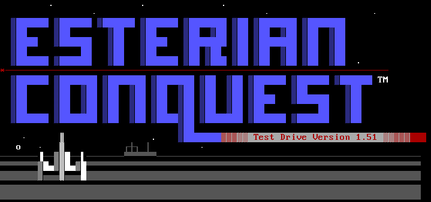

# esterian_conquest



Rust preservation and reimplementation work for Esterian Conquest v1.5.

This project started as a file-format and reverse-engineering effort. It is now
past that stage: the Rust engine can generate classic-compatible game
directories, run maintenance for full campaigns, and stay accepted by the
original DOS toolchain under the project's actual compatibility standard.

## What This Repo Is Doing

Three things at once:

- preserving the original DOS game, manuals, logs, and binaries
- reverse engineering the rules and on-disk formats
- building a modern Rust replacement without giving up classic `.DAT`
  interoperability

The key project rule is simple:

- the manuals are the gameplay spec
- the original binaries are the compatibility oracle
- the classic game directory is still the interchange boundary

That does not mean "byte-identical to one historical run." It means the Rust
side must remain loadable, sane, and acceptable to the original tools while
allowing documented canonical Rust behavior where the original internals are
hidden, stochastic, or not worth cloning literally.

## Current Status

The engine milestone is effectively complete by project criteria.

Today the Rust side can:

- generate joinable new games across the documented `4 / 9 / 16 / 25` player
  tiers
- run repeated maintenance turns through the Rust engine
- handle movement, economy, scouting, diplomacy, conquest, civil disorder,
  fleet defection, and campaign-end recognition
- write classic-compatible `PLAYER.DAT`, `PLANETS.DAT`, `FLEETS.DAT`,
  `CONQUEST.DAT`, `SETUP.DAT`, `DATABASE.DAT`, `RESULTS.DAT`
- preserve classic player mail in `MESSAGES.DAT`
- produce directories the original `ECMAINT` still accepts
- create default `sysop new-game` directories that `ECGAME` can actually join
  through the original onboarding flow

Recent validation:

- `python3 tools/oracle_sweep.py --mode seeded`
  - current result: `12/12` passes
- `python3 tools/rust_maint_sweep.py --turns 3`
  - current result: `8/8` passes
- `cargo test -q`
  - current workspace status: green

In plain terms: Rust is no longer just a scenario generator or fixture toy. It
can run real Esterian Conquest campaigns while staying interoperable with the
original game files.

## Where Rust Intentionally Differs

This project does not treat strict historical byte-for-byte reproduction as the
goal.

Known intentional differences include:

- deterministic Rust combat instead of the original hidden RNG
- conservative explicit campaign-end handling
- Rust-native report wording where exact original text is not required for
  compatibility

Those differences are allowed by the project approach as long as the result
remains faithful to the manuals and compatible with the original `.DAT`
boundary.

For the detailed rationale, see [docs/approach.md](docs/approach.md).

## Next Phase

The next major step is the player client.

The engine/admin side is now strong enough that the project should shift from
"can Rust maintain a game?" to "can Rust replace `ECGAME` well?"

Planned direction:

- keep `ec-data` as the canonical engine/state layer
- keep `ec-cli` as the sysop/admin/oracle tool
- add a Rust player client crate for the `ECGAME` replacement
- start with a local terminal client first
- add BBS door support after the player workflow is solid

That client work is now documented in
[docs/bbs_door_client_rust.md](docs/bbs_door_client_rust.md).

## Quick Start

Create a new game:

```bash
cd rust
cargo run -q -p ec-cli -- sysop new-game /tmp/ec-game --players 4 --seed 1515
```

This default path now creates a joinable pre-player `ECGAME` start with
inactive player slots and `Not Named Yet` homeworld seeds.

Run Rust maintenance:

```bash
cd rust
cargo run -q -p ec-cli -- maint-rust /tmp/ec-game 3
```

Run the original oracle against that directory:

```bash
python3 tools/ecmaint_oracle.py run /tmp/ec-game
```

Launch original `ECGAME` locally in DOSBox-X:

```bash
tools/run_ecgame.sh /tmp/ec-game 1
```

## Useful Commands

New game from declarative config:

```bash
cd rust
cargo run -q -p ec-cli -- sysop new-game /tmp/ec-game --config ec-data/config/setup.example.kdl
```

The bundled example config uses `setup_mode="builder-compatible"` for the
active-campaign baseline used by the maint/oracle sweeps.

Inspect a game directory:

```bash
cd rust
cargo run -q -p ec-cli -- core-report /tmp/ec-game
```

Inspect classic player mail:

```bash
cd rust
cargo run -q -p ec-cli -- inspect-messages /tmp/ec-game
```

Run the broader validation sweeps:

```bash
python3 tools/oracle_sweep.py --mode seeded
python3 tools/rust_maint_sweep.py --turns 3
```

## Read First

- [docs/approach.md](docs/approach.md)
- [docs/next-session.md](docs/next-session.md)
- [docs/rust-architecture.md](docs/rust-architecture.md)

Useful supporting docs:

- [docs/ec-setup-spec.md](docs/ec-setup-spec.md)
- [docs/ec-combat-spec.md](docs/ec-combat-spec.md)
- [docs/ec-movement-spec.md](docs/ec-movement-spec.md)
- [docs/bbs_door_client_rust.md](docs/bbs_door_client_rust.md)
- [docs/dosbox-workflow.md](docs/dosbox-workflow.md)

## Repository Layout

- `original/`: original EC 1.5 materials used as primary sources and oracle
  artifacts
- `docs/`: stable engineering, RE, and design docs
- `RE_NOTES.md`: chronological reverse-engineering notebook
- `rust/ec-data`: canonical Rust state/model/engine crate
- `rust/ec-cli`: sysop/admin/oracle/inspection CLI
- `tools/`: oracle runners, DOSBox helpers, and analysis scripts

## License

The new source code and tooling in this repository are licensed under the MIT
License. See [LICENSE](LICENSE).

The original Esterian Conquest DOS binaries, data files, manuals, logs, and
other preserved game materials remain original works of Bently C. Griffith and
their original rights holders. Their inclusion here is for preservation,
research, and compatibility work; they are not relicensed under MIT by this
repository.
